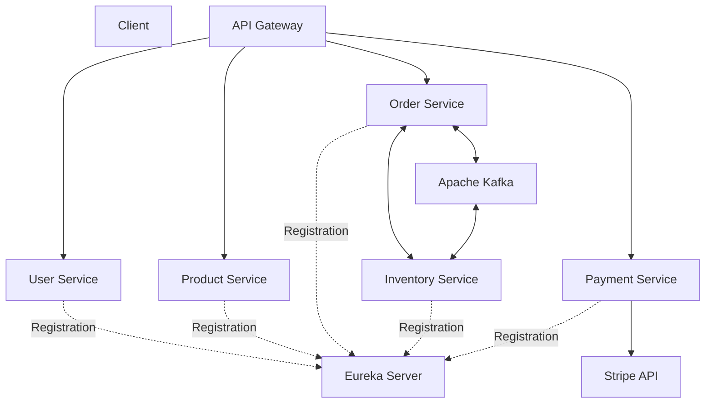

# E-Commerce Microservices Project

## Overview

A backend e-commerce application built using Java, Spring Boot, and Spring Cloud. The project follows a microservices architecture and incorporates service discovery, API Gateway routing, asynchronous messaging with Apache Kafka, and payment processing with Stripe.

## Tech Stack

- **Language:** Java
- **Framework:** Spring Boot
- **Microservices:** Spring Cloud
- **Service Discovery:** Netflix Eureka
- **API Routing:** Spring Cloud API Gateway
- **Inter-Service Communication:** REST APIs and OpenFeign, where configured
- **Messaging:** Apache Kafka
- **Payment Integration:** Stripe API
- **Database:** MySQL
- **ORM:** Spring Data JPA / Hibernate, where used
- **Build Tool:** Maven
- **Containerization:** Docker

## Microservices

| Service | Responsibility |
|---|---|
| User Service | User registration and login |
| Product Service | Product management |
| Order Service | Order placement and order management |
| Inventory Service | Inventory tracking and stock management |
| Payment Service | Payment processing through Stripe |
| API Gateway | Entry point for routing client requests |
| Eureka Server | Service discovery and registration |

## Features

- User registration and login
- Product management
- Order placement and management
- Inventory tracking
- Service discovery using Eureka
- API Gateway routing
- Inter-service communication
- Asynchronous event messaging using Apache Kafka
- Stripe payment integration
- Centralized entry point for client requests

## Architecture

*Architecture note: Adjust the arrows and Kafka connections to match your actual implementation. The diagram is illustrative, not a claim that every connection is already configured.*

## Kafka Integration

The Notification Service contains an Apache Kafka consumer for order events.

- **Topic:** `order-events`
- **Consumer group:** `notification-order-group`
- **Message format:** JSON
- **Processed fields:** Order ID (`id`), total amount (`totalAmount`), and status (`status`)
- **Notification behavior:** Calls `EmailService.sendPaymentEmail()` when the order status is `CREATED`.

The producer configuration, broker connectivity, and end-to-end message delivery should be verified before claiming the complete Kafka workflow as operational.
### Order Event Messaging

The Order Service publishes order events to Apache Kafka using `OrderKafkaProducer`. The Notification Service consumes messages from the `order-events` topic using `OrderKafkaConsumer`.

**Producer**
- Class: `OrderKafkaProducer`
- Topic: `order-events`
- Method: `sendOrderEvent(Object order)`

**Consumer**
- Class: `OrderKafkaConsumer`
- Consumer group: `notification-order-group`
- Parses order ID, total amount, and status from the JSON message.
- Calls `EmailService.sendPaymentEmail()` when the status is `CREATED`.

The producer and consumer implementations are present in the codebase. End-to-end delivery and email sending should be verified in a running environment.

## Stripe Payment Integration

Stripe is integrated with the Payment Service to support payment processing.

A typical PaymentIntent flow is:

1. The client initiates a payment request.
2. The Payment Service receives the request.
3. The backend creates a Stripe PaymentIntent.
4. Stripe returns the PaymentIntent details to the backend.
5. The client completes the payment using the appropriate Stripe client-side flow, if implemented.

**Important:** Creating a PaymentIntent alone does not confirm that a payment has succeeded. Document payment confirmation, webhooks, and order-status updates only if you have implemented them.

## Getting Started

### Prerequisites

- JDK version compatible with the project
- Maven
- MySQL
- Apache Kafka, if running the Kafka components
- Docker, if using containerized services
- Stripe test-mode API keys

### Setup

1. Clone the repository.
2. Configure database connections in the relevant application configuration files.
3. Configure Eureka Server and API Gateway.
4. Configure Kafka broker details and topics if required.
5. Configure Stripe test-mode credentials using environment variables or a secure local configuration.
6. Build the services using Maven.
7. Start the infrastructure components and microservices according to their dependencies.
8. Test the APIs using Postman.

Never commit Stripe secret keys, database passwords, or other credentials to GitHub.

## Testing

Add evidence from the actual application, such as:
- Postman requests and responses
- Successful and failed API scenarios
- Kafka producer and consumer logs
- Stripe test-mode payment results
- Automated test results

## Future Improvements

Potential improvements include:
- Stripe webhook handling
- Reliable order and payment status synchronization
- Kafka retry and dead-letter handling
- Automated integration tests
- Docker Compose for local development
- API documentation and centralized logging

List these as future improvements only when they are not yet implemented.

